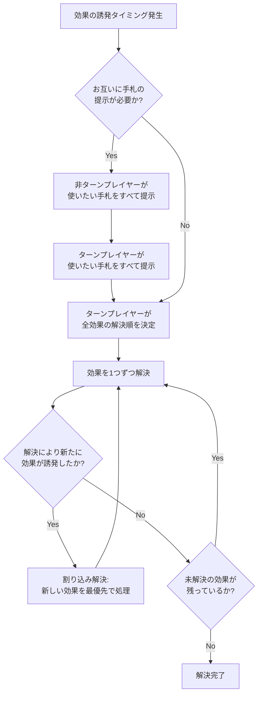

# バトルスピリッツ 効果解決順序フロー図

複数の効果が同じタイミングで誘発した場合の解決手順です。

## 解決フロー図 (Mermaid)

## 解決の重要ルール解説

### 1. ターンプレイヤーの優先権
同時に発生したすべての効果（自分、相手、フィールド、手札、トラッシュ等）の解決順序は、その時の**ターンプレイヤー**がすべて決定します。相手の効果を先に解決させてから自分の効果を使う、といった戦略的な順序指定が可能です。

### 2. 手札効果の提示順
「スピリットが召喚されたとき」などのタイミングで手札から発揮したい効果がある場合、**非ターンプレイヤーが先**にすべての使用カードを提示し、その後にターンプレイヤーが提示します。一度提示しなかったカードは、そのタイミングではもう使用できません。

### 3. 割り込み解決（スタック）
ある効果を解決している途中で、別の「破壊時効果」や「コアが置かれたとき」などの新しい条件が満たされた場合、**現在解決中の一連の処理が一段落した直後**に、その新しい効果を最優先で解決します。

### 4. 効果の連結語による時間差
テキストの繋ぎ言葉によって、解決のタイミングが細かく異なります。

| 連結語 | 解決の扱い | 備考 |
| :--- | :--- | :--- |
| **「さらに」「することで」** | 同時解決 | 他の効果が割り込む隙間がありません。 |
| **「その後」「そうしたとき」** | 連続解決 | 前の処理が終わってから次の処理を行います。 |
| **「その効果発揮後」** | 派生解決 | 前の効果で誘発したすべての処理（破壊の完了など）が終わってから次へ進みます。 |

---
情報元: [バトルスピリッツ公式サイト ルールマニュアル](https://www.battlespirits.com/) / [バトルスピリッツ Wiki](https://batspi.com/)
