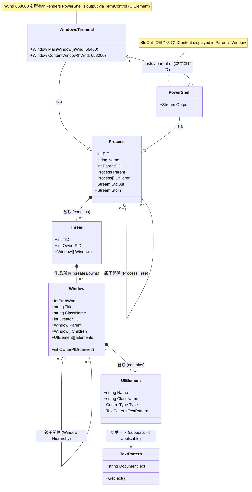

# Windows プロセスとウィンドウの関係性 クラス図

この図は、プロセス、スレッド、ウィンドウ、およびテキストバッファ（UI Automation）の関係性を示しています。特に、ターミナルエミュレータがコンソールアプリケーションをホストする構造に焦点を当てています。

```mermaid
classDiagram
    %% OS プロセス階層
    class Process {
        +int PID
        +string Name
        +int ParentPID
        +Process Parent
        +Process[] Children
        +Stream StdOut
        +Stream StdIn
    }

    class Thread {
        +int TID
        +int OwnerPID
        +Window[] Windows
    }

    %% ウィンドウシステム
    class Window {
        +IntPtr hWnd
        +string Title
        +string ClassName
        +int CreatorTID
        +int OwnerPID (derived)
        +Window Parent
        +Window[] Children
        +UIElement[] Elements
    }

    %% UI Automation とテキストコンテンツ
    class UIElement {
        +string Name
        +string ClassName
        +ControlType Type
        +TextPattern TextPattern
    }

    class TextPattern {
        +string DocumentText
        +GetText()
    }

    %% 関連性
    Process "1" *-- "0..*" Thread : 含む (contains)
    Process "0..1" o-- "0..*" Process : 親子関係 (Process Tree)
    
    Thread "1" *-- "0..*" Window : 作成/所有 (creates/owns)
    
    Window "0..1" o-- "0..*" Window : 親子関係 (Window Hierarchy)
    Window "1" *-- "0..*" UIElement : 含む (contains)
    
    UIElement ..> TextPattern : サポート (supports - if applicable)

    %% 具体例: Windows Terminal が PowerShell をホストする場合
    class WindowsTerminal {
        %% PID: 6432
        +Window MainWindow (hWnd: 66460)
        +Window ContentWindow (hWnd: 658000)
    }
    
    class PowerShell {
        %% PID: 19272
        %% No Window (ウィンドウなし)
        +Stream Output
    }

    WindowsTerminal --|> Process : is a
    PowerShell --|> Process : is a
    
    WindowsTerminal "1" o-- "1" PowerShell : hosts / parent of (親プロセス)
    
    note for WindowsTerminal "hWnd 658000 を所有\nRenders PowerShell's output via TermControl (UIElement)"
    note for PowerShell "StdOut に書き込む\nContent displayed in Parent's Window"
```