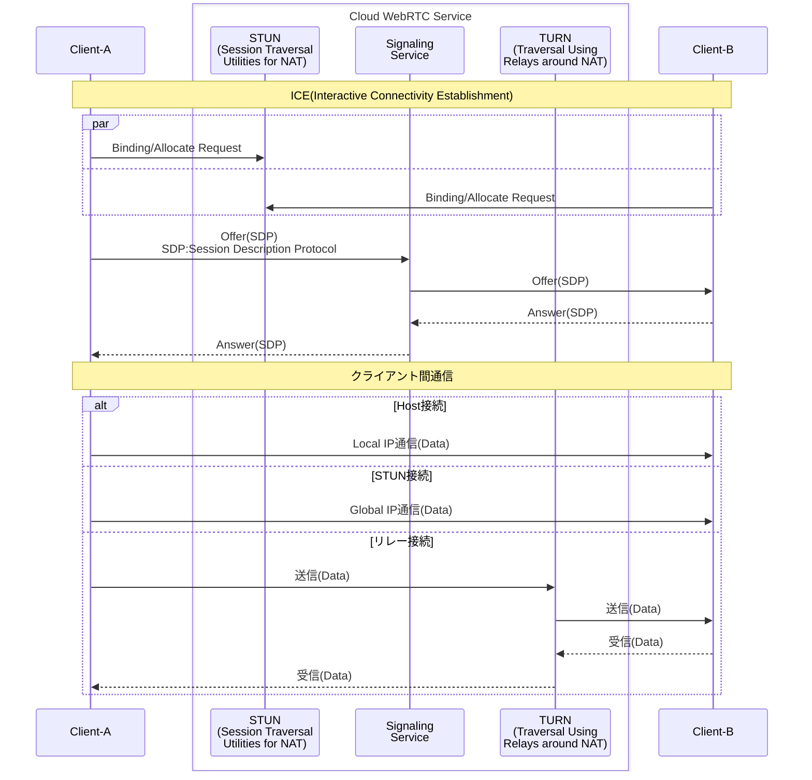

# POC概要
- poc.1: WebSocket を使用した基本的なシグナリングによる P2P メッセージ送受信の基礎。
- poc.2: カメラ映像（getUserMedia）のリアルタイムストリーミング。
- poc.3: P2P が失敗する場合に備えた、内蔵 TURN サーバーによるリレー通信の実装。
- poc.4: カメラ/画面共有の切り替えおよび、TURN 強制モード（iceTransportPolicy: relay）の検証機能。
- poc.5: `mise` を利用した Azure CLI (az) 実行環境のセットアップ自動化。
- poc.7: Azure App Service (Node.js) と Azure Container Instances (coturn) への完全デプロイ。
