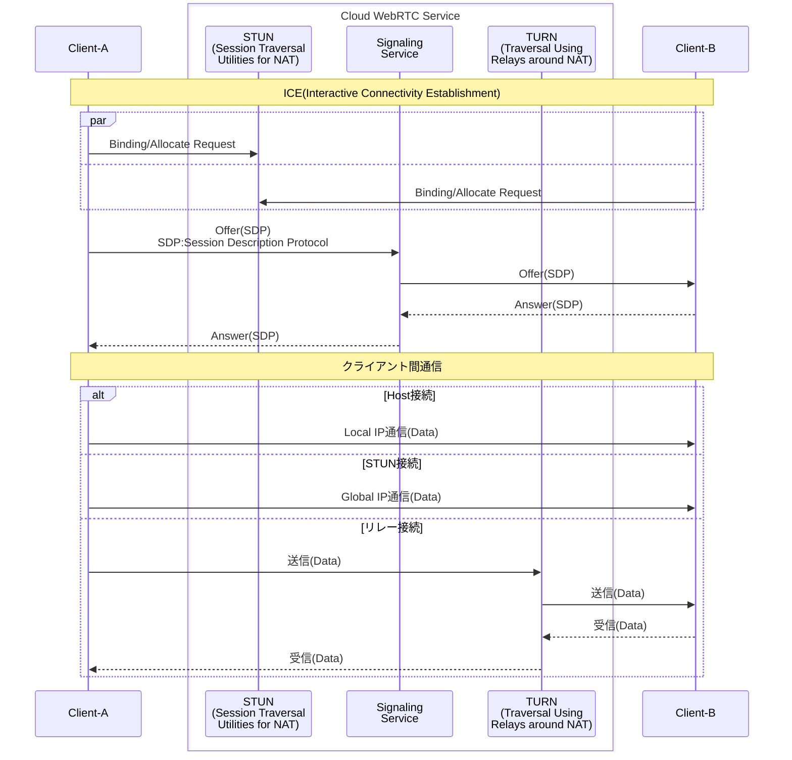

# 概要

クラウドマネージドサービスを使用したWebRTC のサーバとそれ用のWebクライアントの実証
Webクライアントは下記方式いずれかで接続する
- P2PダイレクトIP接続
- NAT/PROXYを経由するダイレクト通信
- インターネット上のサーバを経由するLAN間通信

```mermaid
sequenceDiagram
    participant A as Client-A
    box Cloud WebRTC Service
        participant Srv as STUN<br>(Session Traversal<br>Utilities for NAT)
        participant SIG as Signaling<br>Service
        participant turn as TURN<br>(Traversal Using <br>Relays around NAT)
    end
    participant B as Client-B

    Note over A, B: ICE(Interactive Connectivity Establishment)
    par
        A->>Srv: Binding/Allocate Request
    and
        B->>Srv: Binding/Allocate Request
    end

    A->>SIG: Offer(SDP)<br>SDP:Session Description Protocol
    SIG->>B: Offer(SDP)
    B-->>SIG: Answer(SDP)
    SIG-->>A: Answer(SDP)

    Note over A, B: クライアント間通信

    alt Host接続
        A->>B: Local IP通信(Data)
    else STUN接続
        A->>B: Global IP通信(Data)
    else リレー接続
        A ->> turn: 送信(Data)
        turn ->> B: 送信(Data)
        B -->> turn: 受信(Data)
        turn -->> A:  受信(Data)
    end
```

# 参考

- https://webrtc.github.io/samples/
- https://note.com/npaka/n/n92408f0fa5bf
- https://github.com/novnc/websockify

