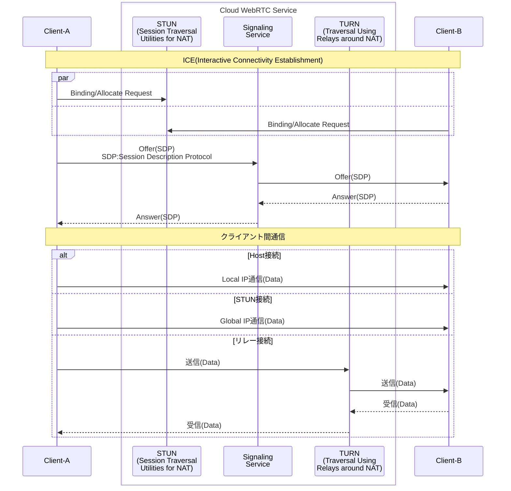

```mermaid
sequenceDiagram
    participant A as Client-A
    box Cloud WebRTC Service
        participant Srv as STUN<br>(Session Traversal<br>Utilities for NAT)
        participant SIG as Signaling<br>Service
        participant turn as TURN<br>(Traversal Using <br>Relays around NAT)
    end
    participant B as Client-B

    Note over A, B: ICE(Interactive Connectivity Establishment)
    par
        A->>Srv: Binding/Allocate Request
    and
        B->>Srv: Binding/Allocate Request
    end

    A->>SIG: Offer(SDP)<br>SDP:Session Description Protocol
    SIG->>B: Offer(SDP)
    B-->>SIG: Answer(SDP)
    SIG-->>A: Answer(SDP)

    Note over A, B: クライアント間通信

    alt Host接続
        A->>B: Local IP通信(Data)
    else STUN接続
        A->>B: Global IP通信(Data)
    else リレー接続
        A ->> turn: 送信(Data)
        turn ->> B: 送信(Data)
        B -->> turn: 受信(Data)
        turn -->> A:  受信(Data)
    end
```

# 開発履歴とディレクトリ構成 (POC Index)
本プロジェクトは、WebRTCの基礎習得から、ネットワーク制約の克服、Azure ACS 統合、そして最終的な独自リレーサーバー構築へと段階的に進化してきました。

### 1. ローカル開発・基礎フェーズ (Basic WebRTC)
- **[poc.1](./poc.1/)**: WebRTCの基本挙動確認。`node-turn` を使用し、ローカル環境での `host` / `relay` 候補の差分を検証。
- **[poc.2](./poc.2/)**: メディアストリーム基礎。カメラ映像および `getDisplayMedia` による画面共有、Canvasフォールバックを実装。
- **[poc.3](./poc.3/)**: セキュアコンテキスト対応。自己署名証明書によるHTTPSサーバー化を行い、ブラウザのWebRTC制限を回避。
- **[poc.4](./poc.4/)**: リレー通信の厳密検証。`iceTransportPolicy: 'relay'` を強制し、TURNサーバー経由のパケット転送をデバッグ。

### 2. Azure Cloud デプロイ・リレー構築フェーズ (Cloud Infrastructure)
- **[poc.5](./poc.5/)**: Azure CLI 開発環境の整備 (`mise` を利用)。
- **[poc.7](./poc.7/)**: Azure App Service (Signaling) と Azure Container Instances (Coturn) の組み合わせによる初のクラウド実証。
- **[poc.8_ACS](./poc.8_ACS/)**: Azure Communication Services (ACS) の TURN サービス利用に向けた初期調査。

### 3. ACS 認証・SDK 調査フェーズ (ACS Deep Dive)
- **[poc.az.acs1](./poc.az.acs1/) / [acs2](./poc.az.acs2/)**: ACS リソース管理。Python SDK を用いた TURN 資格情報の動的取得と Identity 連携の検証。
- **[poc.az.acs3](./poc.az.acs3/)**: Kotlin/JS (Amper) クライアントと ACS Signaling の統合プロトタイプ。

### 4. Kotlin/JS & ACS 統合フェーズ (Advanced Integration)
- **[poc.9](./poc.9/)**: Kotlin/JS への完全移行。ACS TURN サービスの 404 エラー（Identity未連携による Front Door 拒否）を特定。
- **[poc.10](./poc.10/)**: `CommunicationIdentityClient` による Identity 連携を実装し、ACS 提供の TURN サービスが利用可能であることを最終実証。

### 5. アプリケーション実装フェーズ (Product Prototypes)
- **[BoardService](./BoardService/)**: ホワイトボード同期の初期実装。
- **[BoardService4](./BoardService4/)**: ホワイトボード機能に ACI 上の Coturn リレーを統合。プロダクトに近い構成へ。
- **[WhiteBoard5](./WhiteBoard5/)**: **(最新安定版)** 2024年3月の ACS TURN サービス終了に伴い、ACI 上に最適化された Coturn を構築。WebRTC DataChannel による高速な描画同期を実現。
