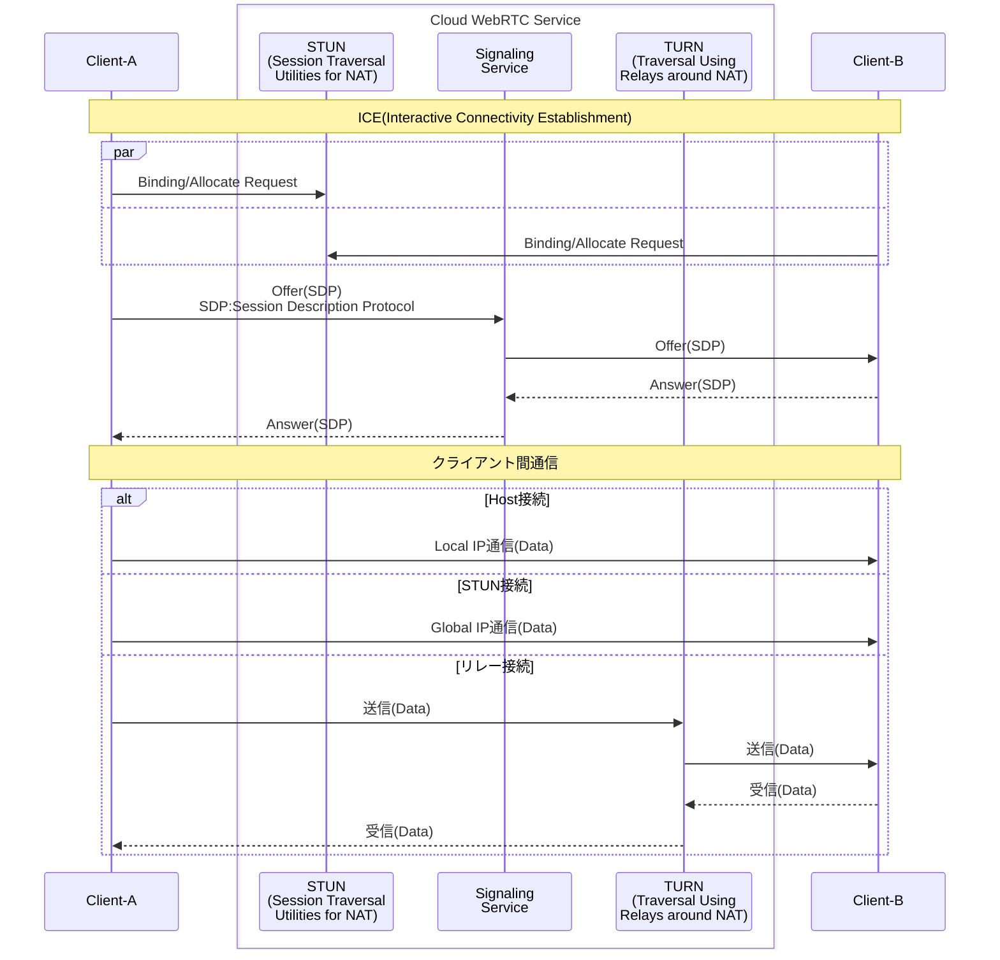

# 概要

クラウドマネージドサービスを使用したWebRTC のサーバとそれ用のWebクライアントの実証
Webクライアントは下記方式いずれかで接続する
- P2PダイレクトIP接続
- NAT/PROXYを経由するダイレクト通信
- インターネット上のサーバを経由するLAN間通信

```mermaid
sequenceDiagram
    participant A as Client-A
    box Cloud WebRTC Service
        participant Srv as STUN<br>(Session Traversal<br>Utilities for NAT)
        participant SIG as Signaling<br>Service
        participant turn as TURN<br>(Traversal Using <br>Relays around NAT)
    end
    participant B as Client-B

    Note over A, B: ICE(Interactive Connectivity Establishment)
    par
        A->>Srv: Binding/Allocate Request
    and
        B->>Srv: Binding/Allocate Request
    end

    A->>SIG: Offer(SDP)<br>SDP:Session Description Protocol
    SIG->>B: Offer(SDP)
    B-->>SIG: Answer(SDP)
    SIG-->>A: Answer(SDP)

    Note over A, B: クライアント間通信

    alt Host接続
        A->>B: Local IP通信(Data)
    else STUN接続
        A->>B: Global IP通信(Data)
    else リレー接続
        A ->> turn: 送信(Data)
        turn ->> B: 送信(Data)
        B -->> turn: 受信(Data)
        turn -->> A:  受信(Data)
    end
```

## ICEの種類 (ICE Candidate Types)

ICE(Interactive Connectivity Establishment)で収集される候補には以下の4種類がある。

- **host (ホスト候補)**: デバイス自体のローカルIPアドレス。同じネットワーク（LAN）内での直接通信に使用。
- **srflx (Server Reflexive / サーバー再帰候補)**: STUNサーバーを介して取得した、NATの外側のパブリックIPアドレス。異なるネットワーク間のP2P通信に使用。
- **prflx (Peer Reflexive / ピア再帰候補)**: 接続確認中に、相手側から見て判明したIPアドレス。対称NAT（Symmetric NAT）環境などで発生。
- **relay (Relayed / リレー候補)**: TURNサーバー経由のIPアドレス。P2P通信が不可能な場合に、サーバーがパケットを中継する最終手段。

ソース: [RFC 8445](https://datatracker.ietf.org/doc/html/rfc8445)

## WebRTC 接続パターン (UDP/TCP)

| 接続タイプ            | プロトコル     | 特徴・用途                                               |
| :--------------- | :-------- | :-------------------------------------------------- |
| **Host**         | UDP       | **同一LAN内。** 端末のプライベートIPを使用して直接通信。最も低遅延。             |
| **STUN (Srflx)** | UDP       | **一般インターネット(WAN)。** NATの外側IPを学習し、P2Pで直接通信。          |
| **TURN (Relay)** | UDP       | **リレー通信。** 直接のP2Pが失敗した場合、サーバがUDPパケットを中継。            |
| **TURN (Relay)** | TCP       | **フォールバック。** UDPが禁止されている企業内ネットワーク等で使用。              |
| **TURN (Relay)** | TLS (TCP) | **最終手段。** Proxy環境やポート制限が厳しい場合、443ポート(HTTPS)に偽装して通信。 |

# 参考

- https://webrtc.github.io/samples/
- https://note.com/npaka/n/n92408f0fa5bf
- https://github.com/novnc/websockify

https://datatracker.ietf.org/doc/html/rfc8445

