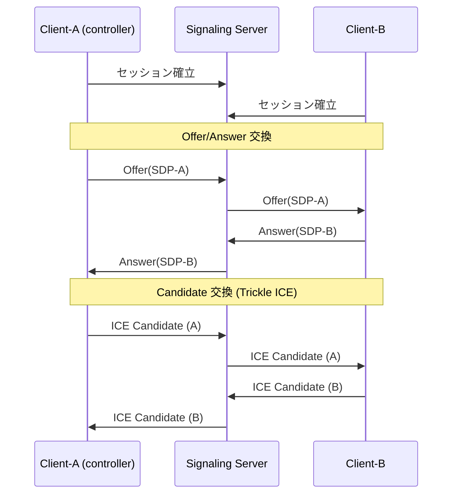
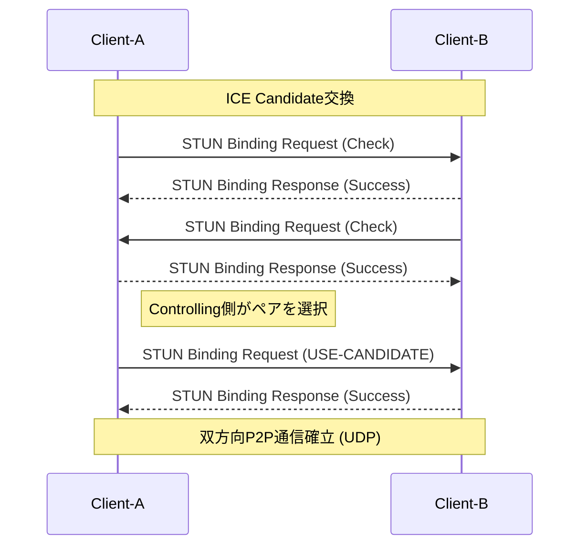
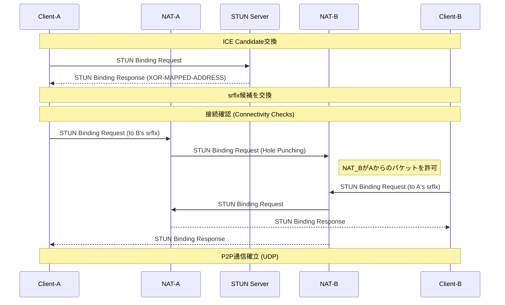
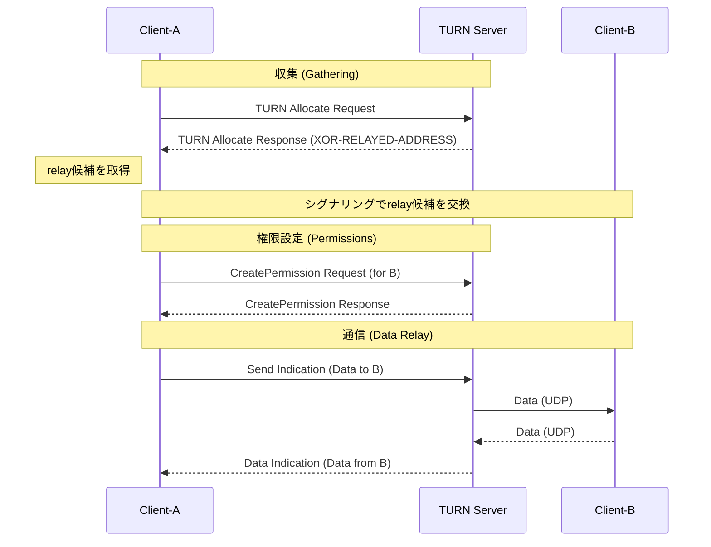
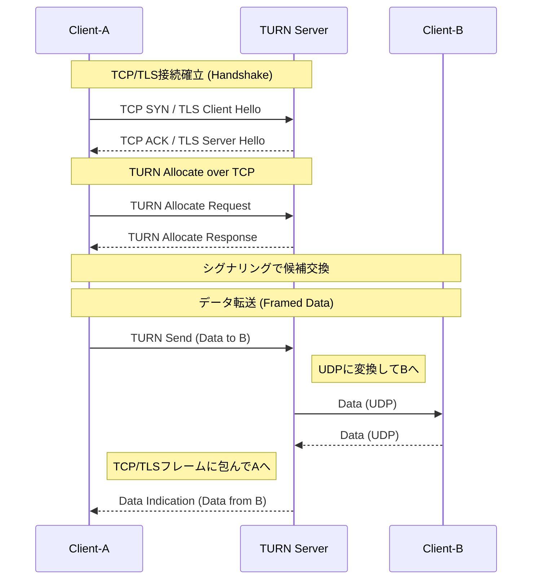

# WebRTC 接続シーケンス (RFC 8445 準拠)

ICE (Interactive Connectivity Establishment) における主要な接続パターン別の通信確立フロー。
## 0. ICE Candidate交換
WebRTC接続を確立するために、SDP (Session Description) や ICE Candidate などの制御情報をピア間で交換するプロセス。

## 1. Host-to-Host (ローカルP2P/UDP)
同一ネットワーク内などで、直接パケットが到達可能な場合のフロー。

## 2. Srflx-to-Srflx (NAT越えP2P / STUN)
異なるネットワーク間で、NATの「ホールパンチング」により直接通信を試みるフロー。

## 3. Relay (TURN経由 / UDP)
Symmetric NAT（対称NAT）間など、直接通信が不可能な場合にサーバーを経由するフロー。

## 4. Relay (TURN経由 / TCP・TLS)
UDPが完全に遮断されている環境で、TCPまたはTLS(Port 443)を介してリレーする最終手段。

---
ソース: 
- [RFC 8445: Interactive Connectivity Establishment (ICE)](https://datatracker.ietf.org/doc/html/rfc8445)
- [RFC 8829: JavaScript Session Establishment Protocol (JSEP)](https://datatracker.ietf.org/doc/html/rfc8829)
